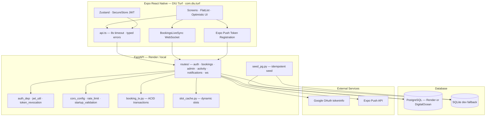

# DIU Turf — Hostel Turf Booking Platform

[](https://expo.dev)
[](https://reactnative.dev)
[](https://fastapi.tiangolo.com)
[](https://www.postgresql.org)
[](https://www.typescriptlang.org)
[](docs/CI_CD.md)

A **mobile-first turf reservation system** for **Daffodil International University (DIU)** hostel students. Students book daily turf slots fairly; admins operate a full control room with audit trails, slot management, and analytics-ready data.

| | |
|---|---|
| **App name** | **DIU Turf** |
| **Package ID** | `com.diu.turf` |
| **Live API** | [`https://diu-turf.onrender.com`](https://diu-turf.onrender.com) |
| **Mobile** | React Native · Expo SDK 54 · TypeScript |
| **Backend** | FastAPI · asyncpg · PostgreSQL (SQLite dev fallback) |
| **Auth** | Google OAuth · DIU email/password · HS256 JWT with revocation |
| **Realtime** | WebSocket broadcast · optimistic UI · silent reconnect |
| **Timezone** | Asia/Dhaka (UTC stored in database) |

---

## Table of Contents

1. [Problem & Solution](#problem--solution)
2. [Screenshots & Demo](#screenshots--demo)
3. [Features](#features)
4. [Tech Stack](#tech-stack)
5. [Architecture](#architecture)
6. [Repository Structure](#repository-structure)
7. [Database](#database)
8. [Business Rules](#business-rules)
9. [Authentication & Authorization](#authentication--authorization)
10. [Security](#security)
11. [Codebase Health](#codebase-health)
12. [Getting Started](#getting-started)
13. [Deployment](#deployment)
14. [Environment Variables](#environment-variables)
15. [API Reference](#api-reference)
16. [WebSocket Events](#websocket-events)
17. [Database Migrations](#database-migrations)
18. [Testing](#testing)
19. [Monitoring](#monitoring)
20. [Production Checklist](#production-checklist)
21. [Documentation](#documentation)
22. [Roadmap](#roadmap)
23. [License](#license)

---

## Problem & Solution

**Problem:** Hostel turf slots are limited and high-demand. Manual or ad-hoc booking leads to double-bookings, unfair usage, and no audit trail.

**Solution:** A full-stack booking platform that enforces fair-use limits **server-side**, supports **FCFS waitlists** with auto-promotion, gives students a live slot board with **real-time updates**, and gives admins operational control with **immutable audit logs**.

**Default turf schedule (Asia/Dhaka):**

| Slot | Time |
|------|------|
| A | 4:00 PM – 5:00 PM |
| B | 5:00 PM – 6:00 PM |
| C | 6:00 PM – 7:00 PM |

Slot templates live in PostgreSQL and are loaded into an in-memory cache at startup — admins can change slots without redeploying code.

---

## Screenshots & Demo

| Endpoint | URL |
|----------|-----|
| Health check | `GET https://diu-turf.onrender.com/api/health` |
| API docs | `https://diu-turf.onrender.com/docs` |
| Service status | `GET https://diu-turf.onrender.com/api/` |

> Add screenshots of Home, Book, My Bookings, and Admin Dashboard to `docs/screenshots/` for portfolio presentation.

---

## Features

### Student experience

| Feature | Description |
|---------|-------------|
| **Google Sign-In** | OAuth via `expo-auth-session` (PKCE); `@diu.edu.bd` enforced server-side |
| **Email/password register & login** | DIU email + student ID validation; bcrypt password hashing |
| **Profile completion** | Required: name, student ID, department, batch · Optional: room, hostel, phone |
| **Home dashboard** | Greeting, next booking countdown, today's schedule, stats, activity preview |
| **Book turf** | Swipeable calendar, per-date slot board, booker identity on occupied slots |
| **Optimistic booking** | Slot reserved instantly; rolls back if API fails |
| **Waitlist** | Join queue on full slots; auto-promotion on cancel |
| **My Bookings** | Tabs: Upcoming · Waitlist · Completed · Cancelled |
| **Activity feed** | Booking/cancellation event stream (PII-scoped for non-admins) |
| **Notifications** | Personal inbox + mark-read / mark-all-read |
| **Local reminders** | 30 / 15 / 5-minute booking reminders (`expo-notifications`) |
| **Push notifications** | Expo push token registration; promotion alerts when waitlist clears |
| **Offline awareness** | Banner when device or server is unreachable |
| **Secure logout** | Server-side JWT revocation via `jti`; token cleared from SecureStore |

### Admin experience

| Feature | Description |
|---------|-------------|
| **Dashboard** | Operational KPIs, audit preview, quick actions |
| **All bookings** | Paginated reservation list |
| **Student management** | Search, detail, suspend/activate/deactivate, profile edit, delete |
| **Slot management** | CRUD, overlap validation, enable/disable |
| **Maintenance days** | Block dates from booking |
| **Announcements** | Broadcast to all students |
| **Force cancel** | Admin override with audit trail |
| **Attendance** | Mark present / absent / late |
| **Analytics preview** | Slot popularity and waitlist demand |

### Platform capabilities

- **ACID booking transactions** — advisory locks + partial unique indexes
- **Waitlist auto-promotion** on cancellation with push notification
- **WebSocket sync** — screens refetch on booking/cancel/waitlist events
- **Dynamic slot cache** — no redeploy to change slots
- **PostgreSQL prod + SQLite dev fallback**
- **Idempotent startup seed** — turf, slots, dev users
- **JWT revocation on logout** — `token_revocations` table checked on every authenticated request and WebSocket connect
- **PostgreSQL-backed rate limiting** — shared across Render instances (`rate_limit_buckets`)
- **Production fail-fast validation** — weak secrets, SQLite, wildcard CORS blocked at startup
- **56 backend tests** — auth, security, bookings, admin, push, Sentry (see [Testing](#testing))

---

## Tech Stack

### Frontend

| Layer | Technology | Version |
|-------|------------|---------|
| Framework | React Native + Expo | 0.81.5 · SDK ~54.0.35 |
| Language | TypeScript (strict) | ~5.9.3 |
| UI | React | 19.1.0 |
| Routing | Expo Router | ~6.0.24 |
| State | Zustand | ^5.0.14 |
| Forms | react-hook-form + Zod | ^7.79 / ^4.4 |
| Auth UI | expo-auth-session (Google PKCE) | ~7.0.11 |
| Google Sign-In | @react-native-google-signin/google-signin | ^16.1.2 |
| Secure storage | expo-secure-store (JWT) | ~15.0.8 |
| Push | expo-notifications | ~0.32.17 |
| Monitoring | @sentry/react-native (optional) | ~7.2.0 |
| Networking | Custom fetch wrapper (8s timeout) | — |

### Backend

| Layer | Technology | Version |
|-------|------------|---------|
| Framework | FastAPI | 0.115.0 |
| Server | Uvicorn | 0.30.0 |
| Database (prod) | PostgreSQL via asyncpg | ≥0.29.0 |
| Database (dev) | SQLite via aiosqlite | ≥0.20.0 |
| Migrations | Alembic + SQLAlchemy asyncio | ≥1.13 / ≥2.0 |
| Validation | Pydantic | ≥2.8.0 |
| Auth | PyJWT (HS256) + passlib/bcrypt | ≥2.10 / ≥1.7 |
| HTTP client | httpx (Google verify, Expo push) | ≥0.27.0 |
| Monitoring | sentry-sdk (optional) | ≥2.0 |
| Tests | pytest + pytest-asyncio | ≥8.0 / ≥0.23 |

**Runtime targets:** Python 3.12+ (CI) · Python 3.13+ (local) · Node 18+ · PostgreSQL 14+

---

## Architecture



**Booking request flow:**

```
Tap Confirm → optimistic UI
  → POST /api/bookings
    → pg_advisory_xact_lock
    → maintenance / suspension / weekly cap / one-per-day checks
    → INSERT booking → notification + activity log
    → COMMIT
  → WebSocket broadcast booking.created
  → affected screens refetch via refresh nonce
```

**Production database options:** Render Postgres (simplest) or [DigitalOcean Managed PostgreSQL](docs/DIGITALOCEAN.md) with the same Render backend — no APK rebuild required.

---

## Repository Structure

```
turf2-main/
├── README.md
│
├── docs/
│   ├── CI_CD.md                      # GitHub Actions, Render, EAS, secrets checklist
│   ├── MONITORING.md                 # Sentry crash/error monitoring setup
│   ├── DIGITALOCEAN.md               # Render backend + DO PostgreSQL guide
│   └── APK_SIZE.md                   # Android APK optimization & release builds
│
├── .github/
│   └── workflows/
│       └── backend-ci.yml            # pytest on push/PR to main
│
├── backend/
│   ├── server.py                     # FastAPI app, lifespan, CORS, security headers, [PERF] middleware
│   ├── requirements.txt
│   ├── alembic.ini
│   ├── .env.example
│   │
│   ├── alembic/
│   │   ├── env.py                    # Alembic + SSL connect_args for DO Postgres
│   │   └── versions/                 # Migrations 001–009
│   │       ├── 001_initial_schema.py
│   │       ├── 002_google_auth_schema.py
│   │       ├── 003_perf_indexes.py
│   │       ├── 004_user_profile_fields.py
│   │       ├── 005_waitlists_status_index.py
│   │       ├── 006_password_auth.py
│   │       ├── 007_user_push_tokens.py
│   │       ├── 008_booking_access_requests.py
│   │       └── 009_rate_limit_buckets.py
│   │
│   ├── config/
│   │   └── admin_emails.py           # Server-side admin role allowlist
│   │
│   ├── database/
│   │   ├── connection.py             # asyncpg pool + SQLite adapter (SSL-aware)
│   │   ├── db_config.py              # Prod blocks SQLite; DATABASE_SSL auto-detect
│   │   ├── booking_tx.py             # ACID create/cancel/promote transactions
│   │   ├── seed_pg.py                # Idempotent turf, slots, dev users
│   │   ├── schema_sqlite.py          # SQLite DDL mirror (incl. rate_limit_buckets)
│   │   ├── sqlite_adapter.py
│   │   ├── health.py
│   │   ├── migration_sql.py
│   │   ├── timing.py
│   │   └── exceptions.py
│   │
│   ├── routes/
│   │   ├── auth.py                   # register, login, google, dev-login, me, logout
│   │   ├── users.py                  # Profile update
│   │   ├── bookings.py               # Slot board, create, cancel, calendar
│   │   ├── admin.py                  # KPIs, students, slots, waitlists, maintenance, audit
│   │   ├── activity.py               # Activity feed + notification inbox
│   │   ├── notifications.py          # Expo push token registration
│   │   └── ws.py                     # WebSocket /api/ws/bookings
│   │
│   ├── services/
│   │   ├── auth_dep.py               # get_current_user, require_admin, require_booking_access
│   │   ├── jwt_util.py               # HS256 issue/decode with jti
│   │   ├── token_revocation.py       # JWT jti revoke + assert on auth/WS
│   │   ├── cors_config.py            # ALLOWED_ORIGINS parsing
│   │   ├── startup_validation.py     # Production fail-fast config checks
│   │   ├── sentry_config.py          # Optional Sentry init + PII scrubbing
│   │   ├── rate_limit.py             # Auth rate limiting (PG buckets or in-memory)
│   │   ├── google_auth.py            # Google verify + @diu.edu.bd guard
│   │   ├── password_util.py          # bcrypt hash/verify
│   │   ├── registration_util.py      # DIU email + student ID rules
│   │   ├── models.py                 # Pydantic request/response schemas
│   │   ├── slot_cache.py             # In-memory active slot templates
│   │   ├── turf_schedule.py          # Dhaka timezone helpers
│   │   ├── push.py                   # Expo push send + token validation
│   │   ├── ws_manager.py             # WebSocket broadcaster
│   │   └── profile_util.py, limits.py, activity.py, serialize.py, …
│   │
│   └── tests/                        # 56 pytest cases across 10 CI modules (see Testing)
│
└── frontend/
    ├── app.json                      # DIU Turf · com.diu.turf
    ├── package.json                  # android:release · android:release:arm64 scripts
    ├── eas.json                      # EAS preview/production APK profiles
    ├── .env.example
    │
    ├── app/                          # Expo Router screens
    │   ├── _layout.tsx               # Fonts, splash, AuthBootstrap
    │   ├── index.tsx                 # Auth-aware redirect
    │   ├── activity.tsx, notifications.tsx
    │   ├── (auth)/                   # login, register, complete-profile
    │   ├── (tabs)/                   # home, book, bookings, profile
    │   └── (admin)/                  # dashboard, students, slots, bookings, activity
    │
    ├── src/
    │   ├── components/               # Button, Card, BookingCalendar, Toast, Skeleton, …
    │   ├── hooks/                    # useBookingsLive, useLiveScreenRefresh, useTicker, …
    │   ├── services/                 # api, auth, booking, admin, waitlist, push, activity
    │   ├── store/                    # Zustand + AuthBootstrap
    │   ├── schemas/                  # Zod — register, profile
    │   ├── config/                   # googleSignIn.ts, sentry.ts (optional crash reporting)
    │   ├── theme/, types/, utils/
    │
    ├── scripts/                      # check-pkg, reset-project, prune-nested-react-native
    ├── assets/images/                # icon, splash, adaptive-icon
    └── android/                      # Native Android project (com.diu.turf, R8/shrink enabled)
```

### Frontend route map

| Route | Screen | Access |
|-------|--------|--------|
| `/(auth)/login` | Google Sign-In + email login | Public |
| `/(auth)/register` | DIU email/password registration | Public |
| `/(auth)/complete-profile` | Profile completion gate | Authenticated |
| `/(tabs)/` | Home dashboard | Student |
| `/(tabs)/book` | Calendar + slot booking | Student |
| `/(tabs)/bookings` | My reservations (4 tabs) | Student |
| `/(tabs)/profile` | View/edit profile, sign out | Student |
| `/activity` | Activity feed | Authenticated |
| `/notifications` | Notification inbox | Authenticated |
| `/(admin)/(tabs)/dashboard` | KPIs + audit preview | Admin |
| `/(admin)/(tabs)/bookings` | All bookings (paginated) | Admin |
| `/(admin)/(tabs)/students` | Student search + list | Admin |
| `/(admin)/student/[userId]` | Student detail + actions | Admin |
| `/(admin)/slots` | Slot template management | Admin |

---

## Database

All primary keys are UUID. Timestamps are `TIMESTAMPTZ` (UTC). Email uses PostgreSQL `citext` for case-insensitive uniqueness.

| Table | Purpose |
|-------|---------|
| `users` | Accounts, profiles, roles, suspension state, `auth_provider`, password hash |
| `turfs` | Turf definitions (seeded: Main Turf) |
| `slot_templates` | Bookable time windows per turf |
| `bookings` | Reservation rows with status lifecycle |
| `waitlists` | FCFS queue per slot per day |
| `maintenance_days` | Dates blocked from booking |
| `attendance` | Admin-marked session attendance |
| `notifications` | Per-user notification inbox |
| `activity_logs` | Activity feed events |
| `audit_logs` | Immutable admin action log |
| `analytics_events` | Append-only telemetry |
| `token_revocations` | Revoked JWT `jti` values — checked on every auth request and WebSocket connect |
| `user_push_tokens` | Expo push tokens per user/device (upsert on register) |
| `rate_limit_buckets` | PostgreSQL-backed auth rate limit counters (migration 009) |

**Key constraints:**

- `uniq_active_slot_per_day` — one active booking per slot per day
- `uniq_active_booking_per_user_per_day` — one active booking per user per day
- `uniq_active_waitlist_per_user` — one active waitlist entry per user per slot per day

**Performance indexes** (migrations 001, 003, 005, 009):

| Table | Index columns |
|-------|---------------|
| `bookings` | `user_id`, `booking_date`, `status`, `(user_id, booking_date)`, `(turf_id, booking_date)` |
| `waitlists` | `(user_id, booking_date)`, `(turf_id, slot_template_id, booking_date)`, `status` |
| `notifications` | `(user_id, created_at DESC)` |
| `activity_logs` | `(created_at DESC)`, `actor_user_id` |
| `users` | `UNIQUE(email)`, `UNIQUE(student_id)`, `role`, `is_active` |
| `rate_limit_buckets` | `(window_start)` |

---

## Business Rules

All rules enforced **server-side** in `database/booking_tx.py`. The client never decides eligibility.

| Rule | Limit / behaviour | Enforcement |
|------|-------------------|-------------|
| DIU email only | `@diu.edu.bd` (incl. subdomains e.g. `@ds.diu.edu.bd`) | `registration_util.py`, `google_auth.py` |
| Student ID format | `\d{3}-\d{2}-\d{3,4}` matching email local-part | `registration_util.py` |
| One booking per day | 1 active booking | Partial unique index + transaction |
| One booking per slot | 1 active booking per slot/date | Advisory lock + partial unique index |
| Weekly booking cap | 5 bookings/week | Transaction step |
| Weekly cancellation cap | 3 cancellations/week | `cancel_booking()` |
| No past slots | Future slots only | `turf_schedule.is_future_slot()` |
| Maintenance block | Date on maintenance list | Transaction step |
| Suspension block | `suspension_until` active | Transaction step (booking); login + `get_current_user` gate |
| Waitlist promotion | First in queue on cancel | `promote_from_waitlist()` |
| Race safety | Concurrent book attempts | Advisory lock + partial unique index |

---

## Authentication & Authorization

### Google OAuth (production)

```
Mobile (expo-auth-session, PKCE) → Google → id_token
  → POST /api/auth/google
    → Server verifies via Google tokeninfo
    → @diu.edu.bd domain check
    → Upsert user · assign role from admin allowlist
    → Issue HS256 JWT (7-day, jti)
  → JWT stored in expo-secure-store
  → GET /api/auth/me on app restore
```

### Email/password (DIU students)

```
POST /api/auth/register → validate DIU email + student ID → bcrypt hash → JWT
POST /api/auth/login    → verify password → check active/suspended → JWT
```

Rate-limited: default **10 attempts / 15 minutes** per client IP on register, login, Google, and dev-login (`AUTH_RATE_LIMIT_*`). PostgreSQL deployments persist counters in `rate_limit_buckets`; SQLite uses in-memory buckets.

### Dev login (development only)

Blocked when `ENVIRONMENT=production` or `DEV_AUTH_ENABLED=false`.

| Account | Email | Role |
|---------|-------|------|
| Admin | `261-35-113@diu.edu.bd` | admin |
| Test student | `252-35-166@diu.edu.bd` | student |

Seeded idempotently on every backend startup via `database/seed_pg.py`.

### JWT revocation (logout)

```
POST /api/auth/logout (Bearer JWT)
  → Extract jti + exp from token
  → INSERT INTO token_revocations (jti, user_id, expires_at)
  → Client clears SecureStore

Subsequent requests / WebSocket connects:
  → get_current_user / ws auth checks token_revocations
  → HTTP 401 "Session revoked" if jti is present and not expired
```

### Role-based access

| Role | Capabilities |
|------|--------------|
| `student` | Book, cancel, waitlist, profile, activity |
| `admin` | All student actions + admin control room |
| `super_admin` | Same as admin (schema supports separation) |

- **`require_admin`** — guards all `/api/admin/*` mutating routes
- **`require_booking_access`** — allows `booker`, `admin`, `super_admin`; rejects others with HTTP 403
- Roles assigned **server-side only** — never trusted from client or JWT claims alone for authorization

### Session restore

```
App launch → AuthBootstrap → read JWT from SecureStore
  → GET /api/auth/me (timeout)
    → 200: route to tabs or admin
    → 401 / network error: clear token → login
```

---

## Security

### Implemented measures (post-hardening)

| Area | Implementation |
|------|----------------|
| **Password storage** | bcrypt via `passlib` — never stored plain text |
| **JWT** | HS256 with `sub`, `email`, `role`, `iat`, `exp`, `jti`; rejects expired/invalid tokens |
| **JWT revocation** | `token_revocations` populated on logout; checked in `get_current_user` + WebSocket auth |
| **Auth rate limiting** | IP-scoped limits on register/login/google/dev-login/push-token (`services/rate_limit.py`) |
| **PostgreSQL rate limits** | `rate_limit_buckets` table shared across Render instances (migration 009) |
| **CORS** | `ALLOWED_ORIGINS` env-driven; `*` only in development without credentials |
| **Production startup validation** | Fails fast on weak `JWT_SECRET`, SQLite, `DEV_AUTH_ENABLED`, wildcard/missing CORS |
| **Security headers** | `X-Content-Type-Options`, `X-Frame-Options`, `Referrer-Policy`, HSTS in production |
| **Suspension enforcement** | HTTP 403 in `get_current_user` when `suspension_until` is active |
| **Activity feed scoping** | Non-admins see own booking activity + public announcements (PII stripped) |
| **Google OAuth** | Server-side tokeninfo verification; issuer, `email_verified`, audience, DIU domain |
| **Input validation** | Pydantic models (backend) + Zod schemas (frontend) |
| **DIU identity rules** | Email domain + student ID regex + email↔ID match on registration |
| **SQL injection** | Parameterized asyncpg queries (`$1`, `$2`, …) throughout |
| **RBAC** | `require_admin`, `require_booking_access`; DB role lookup on every request |
| **Dev auth lockdown** | `/api/auth/dev-login` blocked in production |
| **Secrets** | `.env` gitignored; templates in `.env.example` |
| **JWT storage (mobile)** | `expo-secure-store` — not AsyncStorage |
| **WebSocket auth** | JWT required; user must exist, be active, not suspended, and not revoked |
| **Push tokens** | Auth required; Expo token format validated; rate-limited registration |
| **Booking authorization** | Cancel checks ownership or admin override |
| **Production DB** | SQLite blocked when `ENVIRONMENT=production` |
| **Database SSL** | Auto-detect `sslmode=require` for DigitalOcean; `DATABASE_SSL` override |
| **Generic login errors** | `"Invalid email or password."` — no account enumeration |

### Remaining optional enterprise gaps

| Gap | Severity | Notes |
|-----|----------|-------|
| **JWT in WebSocket query string** | Medium | Prefer post-connect auth or `Sec-WebSocket-Protocol` header (query param kept for mobile compatibility) |
| **7-day JWT, no refresh rotation** | Medium | Shorter access token + refresh flow for high-security deployments |
| **No Redis rate-limit cache** | Low | PostgreSQL buckets suffice for Render; Redis optional at higher scale |
| **No automated token cleanup job** | Low | Expired rows in `token_revocations` are ignored by query; periodic purge optional |
| **No WAF / DDoS layer** | Low | Render platform limits; Cloudflare optional |

> **Security posture:** Core auth, CORS, revocation, suspension, rate limiting, and production validation are implemented. Run `alembic upgrade head` on production to apply migrations **008** and **009**.

---

## Codebase Health

### Backend

| Metric | Status |
|--------|--------|
| **Test suite** | **56 pytest cases** across 10 modules (CI); see [Testing](#testing) |
| **CI** | GitHub Actions — `.github/workflows/backend-ci.yml` on push/PR to `main` |
| **Migrations** | Alembic chain 001→009; raw SQL preserves PostgreSQL-specific features |
| **Type safety** | Pydantic v2 models on all request/response bodies |
| **Error handling** | HTTPException with consistent status codes; transaction rollback on booking failures |
| **Logging** | Structured INFO logs; `[PERF]` timing middleware in development |
| **DB abstraction** | asyncpg pool + SQLite adapter; SSL-aware for DO Postgres; health ping on startup |
| **Documentation** | OpenAPI auto-generated at `/docs` |

### Frontend

| Metric | Status |
|--------|--------|
| **TypeScript** | Strict mode across app and services |
| **Validation** | Zod schemas mirror backend registration rules |
| **State management** | Zustand stores; minimal prop drilling |
| **Network resilience** | 8s timeout, typed errors, offline banner, slow-loading hints |
| **Realtime** | Single WebSocket connection via `BookingsLiveSync`; silent reconnect |
| **Performance** | FlatList virtualization on long lists; optimistic UI for book/cancel/waitlist |
| **APK optimization** | R8 minify + resource shrink + ARM ABI splits — see [docs/APK_SIZE.md](docs/APK_SIZE.md) |
| **Linting** | ESLint via `expo lint` |
| **Tests** | No frontend unit tests yet (backend-only test coverage) |

### Technical debt (tracked)

- `test_phase1_jwt.py` / `test_phase2_bookings.py` — legacy live-server fixtures; excluded from CI
- Frontend test suite not yet established
- iOS build and TestFlight not configured

---

## Getting Started

### Prerequisites

- **Python** 3.12+ (3.13+ recommended locally)
- **Node.js** 18+
- **PostgreSQL** 14+ (optional — SQLite fallback for local dev)
- **Android Studio** + emulator, or physical device

> Google OAuth requires a **development build** (`npx expo run:android`). Expo Go does not support this project's OAuth redirect flow.

### Backend

```powershell
cd backend

python -m venv .venv
.\.venv\Scripts\Activate.ps1
pip install -r requirements.txt

Copy-Item .env.example .env
# Edit JWT_SECRET, DATABASE_URL, Google client IDs

python -m alembic upgrade head
uvicorn server:app --host 0.0.0.0 --port 8001 --reload
```

**Quick local dev (no PostgreSQL):** set `DATABASE_URL=sqlite:///./dev_turf.db` in `backend/.env`.

| URL | Purpose |
|-----|----------|
| `http://localhost:8001/api/` | Service + DB status |
| `http://localhost:8001/docs` | OpenAPI (Swagger) UI |
| `http://localhost:8001/api/health` | Liveness probe |

### Frontend (local dev)

```powershell
cd frontend
npm install --ignore-scripts
Copy-Item .env.example .env
# Set EXPO_PUBLIC_API_BASE_URL (see Environment Variables)
npx expo run:android
```

**Backend URL by target:**

| Target | `EXPO_PUBLIC_API_BASE_URL` |
|--------|----------------------------|
| Android emulator | `http://10.0.2.2:8001` |
| iOS simulator | `http://localhost:8001` |
| Physical device (LAN) | `http://<your-LAN-IP>:8001` |
| Production / shared APK | `https://diu-turf.onrender.com` |

---

## Deployment

See **[docs/CI_CD.md](docs/CI_CD.md)** for GitHub Actions, Render auto-deploy, EAS builds, and the environment secrets checklist.

### Backend — Render

**Start command:**

```bash
cd backend && alembic upgrade head && uvicorn server:app --host 0.0.0.0 --port $PORT
```

**Required env vars:** `DATABASE_URL`, `ENVIRONMENT=production`, `JWT_SECRET`, `DEV_AUTH_ENABLED=false`, `ALLOWED_ORIGINS`, Google OAuth client IDs.

**Health check:** `GET /api/health`

### Database — DigitalOcean PostgreSQL (optional)

Keep the **Render** web service and point `DATABASE_URL` at a **DigitalOcean Managed PostgreSQL** cluster for persistent storage and automated backups. No APK or frontend changes required.

See **[docs/DIGITALOCEAN.md](docs/DIGITALOCEAN.md)** for step-by-step setup, firewall rules, SSL/`sslmode=require`, migration commands, and rollback.

### Frontend — shareable APK (EAS)

```powershell
cd frontend

# One-time
npx eas login

# Build installable APK (Render API baked in via eas.json preview profile)
$env:EAS_NO_VCS = "1"
npx eas build -p android --profile preview

# Download when complete
npx eas build:download -p android
```

**Local release builds** (ARM APKs, R8-optimized — see [docs/APK_SIZE.md](docs/APK_SIZE.md)):

```powershell
cd frontend
yarn android:release          # split arm64 + armeabi APKs
yarn android:release:arm64    # single smallest APK for modern phones
```

Output paths:

```
frontend/android/app/build/outputs/apk/release/app-arm64-v8a-release.apk
frontend/android/app/build/outputs/apk/release/app-armeabi-v7a-release.apk
```

> Prefer **EAS preview** or **`yarn android:release:arm64`** over emulator release builds — emulator defaults produce x86_64 APKs that won't install on phones.

---

## Environment Variables

### `backend/.env`

| Variable | Description | Default |
|----------|-------------|---------|
| `DATABASE_URL` | PostgreSQL DSN or SQLite path | `sqlite:///./dev_turf.db` |
| `DATABASE_SSL` | Force SSL on/off when `sslmode` absent (`true`/`false`) | auto-detect from URL |
| `ENVIRONMENT` | `development` or `production` | `development` |
| `DEV_AUTH_ENABLED` | Enable `/api/auth/dev-login` | `true` |
| `JWT_SECRET` | HS256 signing key (≥32 chars) | — |
| `JWT_ALGORITHM` | JWT algorithm | `HS256` |
| `JWT_EXPIRES_DAYS` | Token lifetime | `7` |
| `AUTH_RATE_LIMIT_MAX` | Auth attempts per window | `10` |
| `AUTH_RATE_LIMIT_WINDOW` | Rate limit window (seconds) | `900` |
| `ALLOWED_ORIGINS` | CORS origins (comma-separated) | `*` (dev only) |
| `ADMIN_EMAIL` | Admin seed email | — |
| `ADMIN_DEFAULT_PASSWORD` | Admin seed password | — |
| `GOOGLE_CLIENT_ID_WEB` | Web OAuth client | — |
| `GOOGLE_CLIENT_ID_ANDROID` | Android OAuth client | — |
| `GOOGLE_CLIENT_ID_IOS` | iOS OAuth client | — |
| `DB_POOL_MIN_SIZE` | asyncpg pool min (PostgreSQL) | `1` |
| `DB_POOL_MAX_SIZE` | asyncpg pool max (PostgreSQL) | `10` |
| `STARTUP_DB_TIMEOUT` | Seed/cache init timeout (seconds) | `15` |
| `SENTRY_DSN` | Sentry backend DSN (optional — unset in dev) | — |
| `SENTRY_RELEASE` | Sentry release tag (e.g. `diu-turf-backend@1.0.0`) | — |
| `SENTRY_TRACES_SAMPLE_RATE` | Performance trace sample rate (`0` = off) | `0` |

### `frontend/.env`

| Variable | Description |
|----------|-------------|
| `EXPO_PUBLIC_API_BASE_URL` | Backend base URL (no trailing slash) |
| `EXPO_PUBLIC_GOOGLE_CLIENT_ID_WEB` | Web OAuth client |
| `EXPO_PUBLIC_GOOGLE_CLIENT_ID_ANDROID` | Android OAuth client |
| `EXPO_PUBLIC_GOOGLE_CLIENT_ID_IOS` | iOS OAuth client |
| `EXPO_PUBLIC_DEV_AUTH_ENABLED` | Show dev login button (`false` for release) |
| `EXPO_PUBLIC_ADMIN_CONTACT_EMAIL` | Shown on login "Report an issue" link |
| `EXPO_PUBLIC_SENTRY_DSN` | Sentry mobile DSN (optional — unset in dev) |
| `EXPO_PUBLIC_ENVIRONMENT` | Sentry environment label (`production`, etc.) |
| `EXPO_PUBLIC_SENTRY_DEBUG` | Send Sentry events from dev builds (`true` for testing) |

See `.env.example` in each directory for full templates. EAS profiles in `eas.json` set `EXPO_PUBLIC_API_BASE_URL` and `EXPO_PUBLIC_DEV_AUTH_ENABLED=false` for preview/production builds.

---

## API Reference

Base path: `/api` · Auth: Bearer JWT unless noted · Interactive docs: `/docs`

**Total: 48 HTTP endpoints + 1 WebSocket**

### Core

| Method | Path | Auth | Description |
|--------|------|------|-------------|
| `GET` | `/api/` | — | Service + DB status |
| `GET` | `/api/health` | — | Liveness probe |
| `WS` | `/api/ws/bookings?token=<jwt>` | JWT | Real-time booking events |

### Auth (`/api/auth`)

| Method | Path | Description |
|--------|------|-------------|
| `POST` | `/auth/register` | DIU email/password registration |
| `POST` | `/auth/login` | Email/password login |
| `POST` | `/auth/google` | Exchange Google `id_token` for JWT |
| `POST` | `/auth/dev-login` | Dev-only shortcut |
| `GET` | `/auth/me` | Current user + `profile_completed` |
| `POST` | `/auth/logout` | Logout — revokes JWT `jti` + audit entry |

### Users (`/api/users`)

| Method | Path | Description |
|--------|------|-------------|
| `PUT` | `/users/profile` | Update profile fields |

### Bookings (`/api/bookings`)

| Method | Path | Description |
|--------|------|-------------|
| `POST` | `/bookings` | Create booking (ACID) |
| `GET` | `/bookings/date/{date}` | Slot board for a date |
| `GET` | `/bookings/occupancy/{date}` | Fill percentage |
| `GET` | `/bookings/calendar/{year}/{month}` | Month calendar |
| `GET` | `/bookings/usage/weekly` | Weekly cap status |
| `GET` | `/bookings/me` | My bookings |
| `DELETE` | `/bookings/{id}` | Cancel + waitlist promotion |

### Waitlists (`/api`)

| Method | Path | Description |
|--------|------|-------------|
| `POST` | `/waitlists` | Join waitlist |
| `GET` | `/waitlists/me` | My waitlist entries |
| `DELETE` | `/waitlists/{id}` | Leave waitlist |

### Activity & Notifications

| Method | Path | Description |
|--------|------|-------------|
| `GET` | `/activity` | Activity feed |
| `GET` | `/notifications/me` | Notification inbox |
| `PUT` | `/notifications/{id}/read` | Mark one read |
| `PUT` | `/notifications/read-all` | Mark all read |
| `POST` | `/notifications/push-token` | Register Expo push token |

### Admin (requires admin role)

| Method | Path | Description |
|--------|------|-------------|
| `GET` | `/admin/kpis` | Operational KPIs |
| `GET` | `/admin/bookings` | Paginated all bookings |
| `GET` | `/admin/students` | Search/list students |
| `GET` | `/admin/students/{id}` | Student detail |
| `POST` | `/admin/students/{id}/suspend` | Suspend student |
| `POST` | `/admin/students/{id}/unsuspend` | Lift suspension |
| `POST` | `/admin/students/{id}/activate` | Reactivate account |
| `POST` | `/admin/students/{id}/deactivate` | Deactivate account |
| `PATCH` | `/admin/students/{id}/profile` | Edit student profile |
| `DELETE` | `/admin/students/{id}` | Delete student |
| `GET` | `/maintenance` | Blocked dates (student-visible) |
| `POST` | `/admin/maintenance` | Schedule maintenance |
| `DELETE` | `/admin/maintenance/{id}` | Remove maintenance |
| `PUT` | `/admin/attendance/{booking_id}` | Mark attendance |
| `POST` | `/admin/announcements` | Broadcast notification |
| `DELETE` | `/admin/bookings/{id}/force-cancel` | Force cancel |
| `GET` | `/admin/audit` | Immutable audit log |
| `GET` | `/admin/slots` | List slot templates |
| `POST` | `/admin/slots` | Create slot |
| `PUT` | `/admin/slots/{id}` | Update slot |
| `PATCH` | `/admin/slots/{id}/disable` | Disable slot |
| `PATCH` | `/admin/slots/{id}/enable` | Enable slot |
| `GET` | `/admin/analytics/preview` | Demand analytics |

---

## WebSocket Events

```
wss://diu-turf.onrender.com/api/ws/bookings?token=<jwt>
```

On connect the server sends `{ "type": "hello", "user_id": "<uuid>" }`.

| Event | Payload highlights | Client action |
|-------|-------------------|---------------|
| `hello` | `user_id` | Connection confirmed |
| `booking.created` | `booking_date`, `slot_id`, … | Refetch slot board / bookings |
| `booking.cancelled` | `booking_date`, `slot_id`, … | Refetch slot board / bookings |
| `waitlist.joined` | `booking_date`, `slot_id` | Refetch waitlist views |
| `waitlist.promoted` | promoted user details | Refetch + push notification to promoted user |
| `maintenance.scheduled` | `date` | Refetch calendar |
| `announcement` | `title` | Refetch notifications / activity |

Reconnection is silent (2.5s retry). No connection status shown to users.

---

## Database Migrations

Run from `backend/`:

```powershell
python -m alembic upgrade head
python -m alembic current
python -m alembic history
```

| Rev | File | Summary |
|-----|------|---------|
| `001` | `001_initial_schema.py` | 11 core tables, `pgcrypto`/`citext` extensions, indexes, partial unique constraints |
| `002` | `002_google_auth_schema.py` | `google_sub`, `token_revocations`, `super_admin` role |
| `003` | `003_perf_indexes.py` | Composite booking indexes |
| `004` | `004_user_profile_fields.py` | `room_number`, `hostel_name`, `phone` |
| `005` | `005_waitlists_status_index.py` | `waitlists(status)` index |
| `006` | `006_password_auth.py` | `auth_provider` column on users |
| `007` | `007_user_push_tokens.py` | `user_push_tokens` for Expo push |
| `008` | `008_booking_access_requests.py` | Booking access roles + `booking_access_requests` table |
| `009` | `009_rate_limit_buckets.py` | `rate_limit_buckets` for PostgreSQL-backed auth rate limiting |

---

## Testing

```powershell
cd backend
.\.venv\Scripts\Activate.ps1
python -m pytest tests/ -v
```

**56 test cases** across 10 CI modules (12 files total). CI (`.github/workflows/backend-ci.yml`) runs all 56 — excludes 2 legacy live-server fixture modules:

```powershell
python -m pytest tests/ -v --ignore=tests/test_phase1_jwt.py --ignore=tests/test_phase2_bookings.py
```

| Test file | Coverage |
|-----------|----------|
| `test_admin_emails.py` | Admin email allowlist |
| `test_admin_slots.py` | Admin slot CRUD helpers |
| `test_dev_seed.py` | Dev user seeding + dev-login |
| `test_password_auth.py` | Register/login, bcrypt, suspension, rate limit |
| `test_perf_indexes.py` | Required DB indexes in migrations |
| `test_phase4_auth.py` | Google auth, JWT issue/decode, profile normalization |
| `test_profile_util.py` | Profile completion rules |
| `test_push_notifications.py` | Push token registration + Expo send |
| `test_security.py` | Logout revocation, suspension gate, CORS, startup validation |
| `test_sentry_config.py` | Sentry init no-op without DSN; accepts DSN when set |
| `test_phase1_jwt.py` | Legacy JWT tests (excluded from CI — import drift) |
| `test_phase2_bookings.py` | Legacy live-server booking tests (excluded from CI) |

Run CI locally — see [docs/CI_CD.md](docs/CI_CD.md#running-ci-locally).

---

## Monitoring

Production crash and error reporting uses **[Sentry](docs/MONITORING.md)** on both the mobile app and FastAPI backend. Monitoring is **optional in local dev** — leave DSN variables unset and both `init_sentry()` / `initSentry()` remain no-ops.

| Component | Implementation | Env var | When active |
|-----------|----------------|---------|-------------|
| Backend | `services/sentry_config.py` (called from `server.py` lifespan) | `SENTRY_DSN` | Set on Render |
| Mobile app | `src/config/sentry.ts` (called from root `_layout.tsx`) | `EXPO_PUBLIC_SENTRY_DSN` | Set in EAS secrets; requires APK rebuild after first Sentry install |

Additional backend vars: `SENTRY_RELEASE`, `SENTRY_TRACES_SAMPLE_RATE`. Mobile: `EXPO_PUBLIC_ENVIRONMENT`, `EXPO_PUBLIC_SENTRY_DEBUG` (send events from dev builds).

See **[docs/MONITORING.md](docs/MONITORING.md)** for: creating Sentry projects, Render/EAS setup, test errors, alerts, privacy scrubbing (`before_send` hooks), and UptimeRobot as a complement.

---

## Production Checklist

### Security

- [ ] `ENVIRONMENT=production` and `DEV_AUTH_ENABLED=false`
- [ ] Strong random `JWT_SECRET` (≥32 chars, never default/committed)
- [ ] PostgreSQL `DATABASE_URL` with SSL for managed providers (`?sslmode=require` for DO)
- [ ] Set `ALLOWED_ORIGINS` to explicit HTTPS origins (see [docs/CI_CD.md](docs/CI_CD.md))
- [x] JWT revocation on logout (`token_revocations`)
- [x] Enforce suspension in `get_current_user`
- [x] Production startup validation (`startup_validation.py`)
- [x] Security response headers (HSTS, X-Frame-Options, …)
- [ ] HTTPS/WSS only (TLS at reverse proxy)
- [ ] Sanitize `.env.example`; rotate any exposed credentials

### Deployment

- [ ] CI passing on `main` (see [docs/CI_CD.md](docs/CI_CD.md))
- [ ] `alembic upgrade head` on production database (**include migrations 008 and 009**)
- [ ] Render health check on `/api/health`
- [ ] Automated PostgreSQL backups ([docs/DIGITALOCEAN.md](docs/DIGITALOCEAN.md) if using DO)
- [ ] `EXPO_PUBLIC_DEV_AUTH_ENABLED=false` in APK build
- [ ] EAS build with production OAuth client IDs
- [ ] Google OAuth consent screen published (exit Testing mode)

### Monitoring

- [ ] Sentry projects created (React Native + Python/FastAPI) — see [docs/MONITORING.md](docs/MONITORING.md)
- [ ] `SENTRY_DSN` set on Render; backend redeployed
- [ ] `EXPO_PUBLIC_SENTRY_DSN` in EAS secrets; new APK built after Sentry install
- [ ] Sentry alert: email on new issue
- [ ] Render health check on `/api/health`; optional UptimeRobot external ping
- [ ] Monitor Render logs and cold-start latency
- [ ] Review `[PERF]` logs under load
- [ ] Track failed auth rate-limit events (HTTP 429)

---

## Documentation

All project guides live in [`docs/`](docs/):

| Guide | Description |
|-------|-------------|
| [docs/CI_CD.md](docs/CI_CD.md) | GitHub Actions CI, Render auto-deploy, EAS build profiles, secrets checklist |
| [docs/MONITORING.md](docs/MONITORING.md) | Sentry setup (backend + mobile), env vars, alerts, privacy scrubbing |
| [docs/DIGITALOCEAN.md](docs/DIGITALOCEAN.md) | Render backend + DigitalOcean Managed PostgreSQL (SSL, firewall, migrations) |
| [docs/APK_SIZE.md](docs/APK_SIZE.md) | Android APK size optimization — R8, ABI splits, `eas.json` / release scripts |

> Add UI screenshots to `docs/screenshots/` for portfolio presentation (see [Screenshots & Demo](#screenshots--demo)).

---

## Roadmap

| Area | Status | Next steps |
|------|--------|------------|
| **Auth hardening** | Done | JWT revocation, suspension gate, rate limits on all auth endpoints |
| **CORS & headers** | Done | Env-driven allowlist, HSTS, security headers middleware |
| **Rate limiting** | Done | PostgreSQL `rate_limit_buckets` (migration 009) |
| **Refresh tokens** | Optional | Shorter access token + refresh rotation |
| **WebSocket auth** | Optional | Move JWT from query string to header/protocol |
| **Booking hardening** | Optional | Idempotency keys for double-tap; user-level advisory locks |
| **Operations** | Optional | Nightly job: expire stale waitlists, purge old revocations, auto-complete past bookings |
| **Frontend tests** | Planned | Component and integration tests with Jest/RTL |
| **iOS** | Planned | OAuth client + TestFlight build |
| **Scale (>100 users)** | Deferred | Redis WebSocket pub/sub, PgBouncer |

---

## License

Internal DIU hostel project. Contact the project maintainers for usage and deployment permissions.

---

*Last updated: 24 June 2026 · DIU Turf · `com.diu.turf` · Expo SDK 54 · Alembic revision 009 · 56 backend tests · Deployed at [diu-turf.onrender.com](https://diu-turf.onrender.com)*
