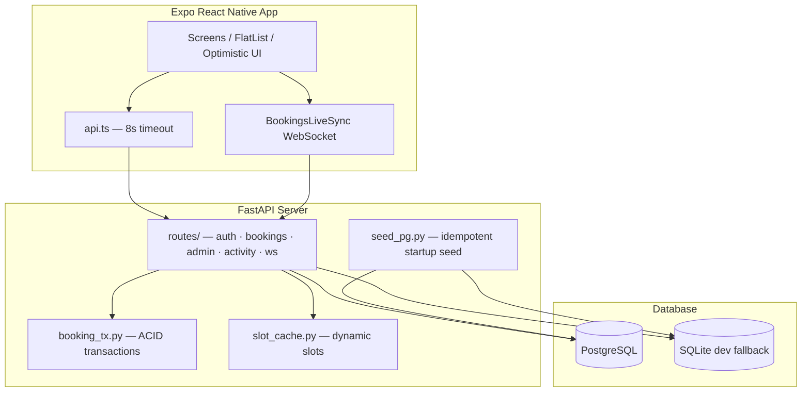

# DIU Hostel Turf Booking

A mobile-first booking platform for **Daffodil International University (DIU) hostel students** to reserve the on-site turf fairly and transparently. The system enforces fair-use limits server-side, supports waitlists with automatic promotion, and provides admins with operational control, audit trails, and analytics-ready data collection.

| | |
|---|---|
| **Mobile** | React Native · Expo SDK 54 · TypeScript |
| **Backend** | FastAPI · asyncpg · PostgreSQL (SQLite fallback for local dev) |
| **Auth** | Google OAuth 2.0 (`@diu.edu.bd`) · HS256 JWT · optional dev-login |
| **Realtime** | WebSocket broadcast · optimistic UI · silent reconnect |
| **Timezone** | Asia/Dhaka (UTC stored in database) |

---

## Table of Contents

1. [Overview](#overview)
2. [Features](#features)
3. [Tech Stack](#tech-stack)
4. [Architecture](#architecture)
5. [Repository Structure](#repository-structure)
6. [Database](#database)
7. [Business Rules](#business-rules)
8. [Authentication](#authentication)
9. [Realtime & Performance](#realtime--performance)
10. [Getting Started](#getting-started)
11. [Environment Variables](#environment-variables)
12. [API Reference](#api-reference)
13. [WebSocket Events](#websocket-events)
14. [Database Migrations](#database-migrations)
15. [Testing](#testing)
16. [Development Notes](#development-notes)
17. [Production Checklist](#production-checklist)
18. [Roadmap](#roadmap)

---

## Overview

Students sign in with a DIU Google account, complete their profile, browse a live slot board, book one of the daily turf sessions, join waitlists when slots are full, and manage bookings from a dedicated tab. Admins operate a control room with KPIs, student management, slot configuration, maintenance scheduling, announcements, and immutable audit logs.

**Default turf schedule (Asia/Dhaka):**

| Slot | Time |
|------|------|
| A | 4:00 PM – 5:00 PM |
| B | 5:00 PM – 6:00 PM |
| C | 6:00 PM – 7:00 PM |

Slot definitions are stored in `slot_templates` and loaded into an in-memory cache at startup. Admins can add, edit, enable, or disable slots without redeploying code.

---

## Features

### Student experience

| Feature | Description |
|---------|-------------|
| **Google Sign-In** | Authorization code + PKCE via `expo-auth-session`; domain restricted to `@diu.edu.bd` on the server |
| **Dev login** | Email/password shortcut for local testing (disabled in production) |
| **Profile completion** | Required: name, student ID, department, batch · Optional: room, hostel, phone |
| **Home dashboard** | Greeting, next upcoming booking with live countdown, today's schedule, stats, activity preview |
| **Book turf** | Swipeable calendar, per-date slot board, booker identity on occupied slots |
| **Optimistic booking** | Slot appears reserved instantly; rolls back if the API fails |
| **Waitlist** | Join queue on full slots; optimistic UI; promotion notification when promoted |
| **My Bookings** | Tabs: Upcoming · Waitlist · Completed · Cancelled · live countdown timers |
| **Optimistic cancel** | Booking disappears from Upcoming immediately; rolls back on failure |
| **Activity feed** | Public event stream (bookings, cancellations) with meaningful filtering |
| **Notifications** | Personal inbox with mark-read / mark-all-read |
| **Local reminders** | 30 / 15 / 5-minute booking reminders via `expo-notifications` |
| **Offline awareness** | Banner when device or server is unreachable |

### Admin experience

| Feature | Description |
|---------|-------------|
| **Dashboard** | Operational KPIs, unified audit feed, quick actions |
| **All bookings** | Paginated reservation list across all students |
| **Student management** | Search, list, detail view, booking counts, suspend / activate |
| **Slot management** | CRUD for slot templates, overlap validation, enable/disable |
| **Maintenance days** | Block dates from booking |
| **Announcements** | Fan-out notification to all students |
| **Force cancel** | Admin override with audit trail |
| **Attendance** | Mark present / absent / late per booking |
| **Analytics preview** | Slot popularity and waitlist demand snapshot |

### Platform capabilities

- **ACID booking transactions** with advisory locks and partial unique indexes
- **Waitlist auto-promotion** when a booking is cancelled
- **WebSocket sync** — screens refetch silently on booking/cancel/waitlist events
- **Virtualized lists** — `FlatList` on long-scrolling screens (bookings, activity, notifications, admin lists)
- **API timeouts** — 8-second default with friendly retry UX
- **Dev performance logging** — `[PERF] GET /api/... took Nms` when `ENVIRONMENT=development`
- **Indexed queries** — composite indexes on hot paths (see [Database Migrations](#database-migrations))

---

## Tech Stack

### Frontend

| Layer | Technology |
|-------|------------|
| Framework | React Native 0.81 · Expo SDK 54 |
| Language | TypeScript (strict) |
| Routing | Expo Router v6 (file-based) |
| State | Zustand (`useAuthStore`, `useBookingsRefreshStore`) |
| Forms | react-hook-form + Zod |
| Auth UI | expo-auth-session (Google OAuth, PKCE) |
| Secure storage | expo-secure-store (JWT only) |
| Notifications | expo-notifications (local scheduled) |
| Networking | Custom `fetch` wrapper with timeout and typed errors |

### Backend

| Layer | Technology |
|-------|------------|
| Framework | FastAPI |
| Database (prod) | PostgreSQL 14+ via asyncpg |
| Database (dev) | SQLite via aiosqlite (automatic fallback) |
| Migrations | Alembic (raw SQL migrations) |
| Auth | Google token verification · HS256 JWT with `jti` |
| Realtime | In-process WebSocket manager (single-process MVP scale) |
| Password hashing | bcrypt (admin seed + dev-login only) |

---

## Architecture



**Request flow (booking):**

```
Tap "Confirm" → optimistic UI update
    → POST /api/bookings
        → pg_advisory_xact_lock
        → maintenance / suspension / weekly cap / one-per-day checks
        → INSERT booking
        → notification + activity log
        → COMMIT
    → WebSocket broadcast booking.created
    → affected screens refetch via nonce bump
```

---

## Repository Structure

```
turf2-main/
├── backend/
│   ├── server.py                 # FastAPI app, lifespan, CORS, [PERF] middleware
│   ├── alembic/                  # Database migrations (001–005)
│   ├── alembic.ini
│   ├── database/
│   │   ├── connection.py         # asyncpg pool + SQLite adapter
│   │   ├── booking_tx.py         # ACID create/cancel/promote transactions
│   │   ├── seed_pg.py            # Idempotent turf, slots, dev users
│   │   ├── schema_sqlite.py      # SQLite DDL mirror for local dev
│   │   └── health.py             # Startup DB ping
│   ├── routes/
│   │   ├── auth.py               # Google OAuth, dev-login, me, logout
│   │   ├── users.py              # Profile update
│   │   ├── bookings.py           # Slot board, create, cancel, calendar
│   │   ├── admin.py              # KPIs, students, slots, maintenance, audit
│   │   ├── activity.py           # Activity feed + notifications
│   │   └── ws.py                 # WebSocket /api/ws/bookings
│   ├── services/
│   │   ├── auth_dep.py           # JWT dependency, require_admin
│   │   ├── google_auth.py        # Google verify + @diu.edu.bd guard
│   │   ├── jwt_util.py           # Issue/decode HS256 tokens
│   │   ├── models.py             # Pydantic schemas
│   │   ├── slot_cache.py         # In-memory active slot templates
│   │   ├── turf_schedule.py      # Dhaka timezone helpers
│   │   ├── profile_util.py       # profile_completed logic
│   │   ├── limits.py             # Weekly cap queries
│   │   └── ws_manager.py         # WebSocket broadcaster
│   ├── config/
│   │   └── admin_emails.py       # Admin email allowlist
│   └── tests/                    # pytest suite
│
└── frontend/
    ├── app/                      # Expo Router screens
    │   ├── _layout.tsx           # Root: fonts, splash, AuthBootstrap
    │   ├── index.tsx             # Auth-aware entry redirect
    │   ├── (auth)/               # login, complete-profile
    │   ├── (tabs)/               # Home, Book, My Bookings, Profile
    │   ├── (admin)/              # Admin stack + tabs + slots + student detail
    │   ├── activity.tsx
    │   └── notifications.tsx
    └── src/
        ├── components/           # Button, Card, ErrorState, Skeleton, Toast, …
        ├── hooks/                # useBookingsLive, useLiveScreenRefresh, useTicker, …
        ├── services/             # api, auth, booking, waitlist, admin, activity
        ├── store/                # Zustand stores + AuthBootstrap
        ├── theme/                # Colors, typography, spacing
        ├── types/                # Shared TypeScript types
        └── utils/                # datetime, errors, userDisplay, storage
```

### Frontend route map

| Route | Screen | Role |
|-------|--------|------|
| `/(auth)/login` | Google Sign-In + dev login | Public |
| `/(auth)/complete-profile` | Profile form (required fields) | Student |
| `/(tabs)/` | Home dashboard | Student |
| `/(tabs)/book` | Calendar + slot booking | Student |
| `/(tabs)/bookings` | My reservations (4 tabs) | Student |
| `/(tabs)/profile` | View/edit profile, sign out | Student |
| `/activity` | Full activity feed | Authenticated |
| `/notifications` | Notification inbox | Authenticated |
| `/(admin)/(tabs)/dashboard` | KPIs + audit preview | Admin |
| `/(admin)/(tabs)/bookings` | All bookings (paginated) | Admin |
| `/(admin)/(tabs)/students` | Student search + list | Admin |
| `/(admin)/student/[userId]` | Student detail + actions | Admin |
| `/(admin)/slots` | Slot template management | Admin |
| `/(admin)/(tabs)/activity` | Activity feed (admin tab) | Admin |
| `/(admin)/(tabs)/notifications` | Alerts (admin tab) | Admin |

---

## Database

All primary keys are UUID. Timestamps are `TIMESTAMPTZ` (UTC). Email uses PostgreSQL `citext` for case-insensitive uniqueness.

| Table | Purpose |
|-------|---------|
| `users` | Accounts, profiles, roles, suspension state |
| `turfs` | Turf definitions (one seeded: Main Turf) |
| `slot_templates` | Bookable time windows per turf |
| `bookings` | Reservation rows with status lifecycle |
| `waitlists` | FCFS queue per slot per day |
| `maintenance_days` | Dates blocked from booking |
| `attendance` | Admin-marked session attendance |
| `notifications` | Per-user notification inbox |
| `activity_logs` | Public activity feed events |
| `audit_logs` | Immutable admin action log |
| `analytics_events` | Append-only ML/analytics telemetry |
| `token_revocations` | JWT `jti` revocation store |

**Key constraints:**

- `uniq_active_slot_per_day` — one active booking per slot per day
- `uniq_active_booking_per_user_per_day` — one active booking per user per day
- `uniq_active_waitlist_per_user` — one active waitlist entry per user per slot per day

**Performance indexes** (PostgreSQL migrations 001, 003, 005):

| Table | Index columns |
|-------|---------------|
| `bookings` | `user_id`, `booking_date`, `status`, `(user_id, booking_date)`, `(turf_id, booking_date)`, `slot_template_id` |
| `waitlists` | `(user_id, booking_date)`, `(turf_id, slot_template_id, booking_date)`, `status` |
| `notifications` | `(user_id, created_at DESC)` |
| `activity_logs` | `(created_at DESC)`, `actor_user_id` |
| `users` | `UNIQUE(email)`, `UNIQUE(student_id)`, `role`, `is_active` |

---

## Business Rules

All rules are enforced **server-side** in `database/booking_tx.py` and route handlers. The client never decides eligibility.

| Rule | Limit / behaviour | Enforcement |
|------|-------------------|-------------|
| DIU email only | `@diu.edu.bd` | `services/google_auth.py` |
| One booking per day | 1 active booking | Partial unique index + transaction check |
| One booking per slot | 1 active booking per slot/date | Partial unique index + advisory lock |
| Weekly booking cap | 5 bookings/week | Transaction step 4 |
| Weekly cancellation cap | 3 cancellations/week | `cancel_booking()` |
| No past slots | Future slots only | `turf_schedule.is_future_slot()` |
| Maintenance block | Date on maintenance list | Transaction step 2 |
| Suspension block | `suspension_until` active | Transaction step 3 |
| Waitlist promotion | First in queue on cancel | `promote_from_waitlist()` |
| Race safety | Concurrent book attempts | Advisory lock + partial unique index |

**Booking transaction (10 steps):**

1. Advisory lock on `(turf, slot, date)`
2. Maintenance check
3. Suspension / active account check
4. Weekly booking cap check
5. One-booking-per-day check
6. `INSERT` booking
7. Cancel user's waitlist entry for same slot (if any)
8. Confirmation notification
9. Activity log entry
10. Commit (rollback on any failure)

---

## Authentication

### Google OAuth (production path)

```
Mobile app (expo-auth-session, PKCE)
    → Google sign-in
    → id_token
    → POST /api/auth/google { id_token }
        → Server verifies via Google tokeninfo
        → @diu.edu.bd domain check
        → Upsert user in PostgreSQL
        → Issue HS256 JWT (7-day, jti)
    → JWT stored in expo-secure-store
    → GET /api/auth/me on app restore
```

Domain restriction and role assignment happen **only on the server**. The frontend never trusts client-supplied email or role.

### Dev login (development only)

When `ENVIRONMENT=development` and `DEV_AUTH_ENABLED=true`:

| Account | Email | Role | Notes |
|---------|-------|------|-------|
| Admin | `261-35-113@diu.edu.bd` | admin | Password from `ADMIN_DEFAULT_PASSWORD` |
| Test student | `252-35-166@diu.edu.bd` | student | Pre-seeded profile (SWE, batch 47, room 402) |

Both accounts are ensured idempotently on every backend startup via `database/seed_pg.py`.

### Session restore

```
App launch → AuthBootstrap → restoreSession()
    → Read JWT from SecureStore
    → GET /api/auth/me (5s timeout)
        → 200: route to tabs or admin
        → 401 / network error: clear token → login
```

---

## Realtime & Performance

Designed for **<100 concurrent users** without Redis, read replicas, or connection poolers.

| Mechanism | Implementation |
|-----------|----------------|
| **WebSocket** | Single `BookingsLiveSync` component in `AuthBootstrap`; silent reconnect every 2.5s |
| **Screen refresh** | `useLiveScreenRefresh` — refetch on focus, pull-to-refresh, mutation success, or WS event |
| **Optimistic UI** | Book, cancel, and waitlist update instantly; rollback on API failure |
| **Countdowns** | `useTicker(1000)` — local timer only, no per-second API polling |
| **List virtualization** | `FlatList` on My Bookings, Activity, Notifications, Admin Bookings/Students |
| **API timeout** | 8-second `AbortController` on all requests; friendly error messages |
| **Backend timing** | `[PERF] METHOD /api/path took Nms` in development |

**WebSocket endpoint:**

```
ws://HOST:PORT/api/ws/bookings?token=<jwt>
```

---

## Getting Started

### Prerequisites

- **Python** 3.13+
- **Node.js** 18+
- **PostgreSQL** 14+ (optional — SQLite fallback works for local dev)
- **Android Studio** + emulator, or a physical device with a dev build

> **Note:** Google OAuth requires a **development build** (`npx expo run:android`). Expo Go does not support the OAuth redirect flow used in this project.

### Backend

```powershell
cd backend

# Virtual environment
python -m venv .venv
.\.venv\Scripts\Activate.ps1

# Dependencies
pip install -r requirements.txt

# Environment
Copy-Item .env.example .env
# Edit JWT_SECRET, DATABASE_URL, Google client IDs as needed

# PostgreSQL (production path)
# CREATE DATABASE turf_db;
# CREATE EXTENSION pgcrypto;
# CREATE EXTENSION citext;
python -m alembic upgrade head

# Start server (seeds turf, slots, dev users on startup)
uvicorn server:app --host 0.0.0.0 --port 8001 --reload
```

**Quick local dev (no PostgreSQL):** set `DATABASE_URL=sqlite:///./dev_turf.db` in `backend/.env`. The server creates the SQLite schema automatically.

| URL | Purpose |
|-----|---------|
| `http://localhost:8001/api/` | Service health + DB status |
| `http://localhost:8001/docs` | OpenAPI (Swagger) UI |
| `http://localhost:8001/api/health` | Liveness probe |

### Frontend

```powershell
cd frontend

npm install --ignore-scripts

Copy-Item .env.example .env
# Set EXPO_PUBLIC_API_BASE_URL (see below)

npx expo run:android
```

**Backend URL by target:**

| Target | `EXPO_PUBLIC_API_BASE_URL` |
|--------|----------------------------|
| APK / physical devices / testers (default) | `https://diu-turf.onrender.com` |
| Android emulator + local backend | `http://10.0.2.2:8001` |
| iOS simulator + local backend | `http://localhost:8001` |
| Physical device + local backend | `http://<your-LAN-IP>:8001` |

### Google Cloud Console

1. Create OAuth 2.0 clients in one Google Cloud project:
   - **Web** — for backend audience validation
   - **Android** — package `com.diu.turf` + debug SHA-1 from `./gradlew signingReport`
   - **iOS** — bundle ID `com.diu.turf` (when testing iOS)
2. Enable the Google Identity API.
3. If the consent screen is in **Testing** mode, add test `@diu.edu.bd` accounts.
4. Copy client IDs into both `backend/.env` and `frontend/.env`.

---

## Environment Variables

### `backend/.env`

| Variable | Description | Default |
|----------|-------------|---------|
| `DATABASE_URL` | PostgreSQL DSN or `sqlite:///./dev_turf.db` | SQLite dev path |
| `ENVIRONMENT` | `development` or `production` | `development` |
| `DEV_AUTH_ENABLED` | Enable `/api/auth/dev-login` | `true` |
| `JWT_SECRET` | HS256 signing key (64-byte hex recommended) | — |
| `JWT_ALGORITHM` | Token algorithm | `HS256` |
| `JWT_EXPIRES_DAYS` | Token lifetime | `7` |
| `ADMIN_EMAIL` | Admin seed email | `261-35-113@diu.edu.bd` |
| `ADMIN_DEFAULT_PASSWORD` | Admin/dev password | — |
| `GOOGLE_CLIENT_ID_WEB` | Web OAuth client | — |
| `GOOGLE_CLIENT_ID_ANDROID` | Android OAuth client | — |
| `GOOGLE_CLIENT_ID_IOS` | iOS OAuth client | — |
| `ALLOWED_ORIGINS` | CORS origins (`*` for dev) | `*` |

### `frontend/.env`

| Variable | Description |
|----------|-------------|
| `EXPO_PUBLIC_API_BASE_URL` | Backend base URL (no trailing slash) |
| `EXPO_PUBLIC_GOOGLE_CLIENT_ID_WEB` | Web OAuth client |
| `EXPO_PUBLIC_GOOGLE_CLIENT_ID_ANDROID` | Android OAuth client |
| `EXPO_PUBLIC_GOOGLE_CLIENT_ID_IOS` | iOS OAuth client |
| `EXPO_PUBLIC_DEV_AUTH_ENABLED` | Show dev login button (`true`/`false`) |

See `.env.example` in each directory for full templates.

---

## API Reference

Base path: `/api`

### Authentication

| Method | Path | Auth | Description |
|--------|------|------|-------------|
| `POST` | `/auth/google` | — | Exchange Google `id_token` for JWT |
| `POST` | `/auth/dev-login` | — | Dev-only email/password login |
| `GET` | `/auth/me` | Bearer | Current user + `profile_completed` |
| `POST` | `/auth/logout` | Bearer | Logout (audit entry; client clears JWT) |

### Users

| Method | Path | Auth | Description |
|--------|------|------|-------------|
| `PUT` | `/users/profile` | Bearer | Update profile fields |

### Bookings

| Method | Path | Auth | Description |
|--------|------|------|-------------|
| `GET` | `/bookings/date/{date}` | Bearer | Slot board for a date |
| `POST` | `/bookings` | Bearer | Create booking (ACID transaction) |
| `DELETE` | `/bookings/{id}` | Bearer | Cancel + waitlist promotion |
| `GET` | `/bookings/me` | Bearer | Current user's bookings |
| `GET` | `/bookings/occupancy/{date}` | Bearer | Fill percentage |
| `GET` | `/bookings/calendar/{year}/{month}` | Bearer | Month calendar data |
| `GET` | `/bookings/usage/weekly` | Bearer | Weekly cap status |

### Waitlists

| Method | Path | Auth | Description |
|--------|------|------|-------------|
| `POST` | `/waitlists` | Bearer | Join waitlist for a full slot |
| `GET` | `/waitlists/me` | Bearer | My waitlist entries |
| `DELETE` | `/waitlists/{id}` | Bearer | Leave waitlist |

### Activity & Notifications

| Method | Path | Auth | Description |
|--------|------|------|-------------|
| `GET` | `/activity` | Bearer | Public activity feed |
| `GET` | `/notifications/me` | Bearer | My notifications |
| `PUT` | `/notifications/{id}/read` | Bearer | Mark one read |
| `PUT` | `/notifications/read-all` | Bearer | Mark all read |

### Admin (requires admin role)

| Method | Path | Description |
|--------|------|-------------|
| `GET` | `/admin/kpis` | Operational KPIs |
| `GET` | `/admin/bookings` | Paginated all bookings |
| `GET` | `/admin/students` | Search/list students |
| `GET` | `/admin/students/{id}` | Student detail + history |
| `POST` | `/admin/students/{id}/suspend` | Suspend student |
| `POST` | `/admin/students/{id}/unsuspend` | Lift suspension |
| `POST` | `/admin/students/{id}/activate` | Reactivate account |
| `GET` | `/admin/slots` | List slot templates |
| `POST` | `/admin/slots` | Create slot template |
| `PUT` | `/admin/slots/{id}` | Update slot template |
| `PATCH` | `/admin/slots/{id}/disable` | Disable slot |
| `PATCH` | `/admin/slots/{id}/enable` | Enable slot |
| `GET` | `/maintenance` | Student-visible blocked dates |
| `POST` | `/admin/maintenance` | Schedule maintenance day |
| `DELETE` | `/admin/maintenance/{id}` | Remove maintenance day |
| `PUT` | `/admin/attendance/{booking_id}` | Mark attendance |
| `POST` | `/admin/announcements` | Broadcast to all students |
| `DELETE` | `/admin/bookings/{id}/force-cancel` | Admin force cancel |
| `GET` | `/admin/audit` | Immutable audit log |
| `GET` | `/admin/analytics/preview` | Demand analytics snapshot |

Interactive documentation: **`http://localhost:8001/docs`**

---

## WebSocket Events

Connect with a valid JWT:

```
ws://localhost:8001/api/ws/bookings?token=<jwt>
```

| Event type | Triggers screen refetch |
|------------|-------------------------|
| `booking.created` | Yes |
| `booking.cancelled` | Yes |
| `waitlist.joined` | Yes |
| `waitlist.promoted` | Yes (+ local notification if promoted user) |

The client does not display connection status. Reconnection is silent.

---

## Database Migrations

Run from `backend/`:

```powershell
python -m alembic upgrade head
python -m alembic current    # verify revision
python -m alembic history    # list migrations
```

| Revision | File | Summary |
|----------|------|---------|
| `001` | `001_initial_schema.py` | 11 tables, indexes, partial unique constraints |
| `002` | `002_google_auth_schema.py` | `google_sub`, `token_revocations`, `super_admin` role |
| `003` | `003_perf_indexes.py` | Composite booking indexes `(user_id, date)`, `(turf_id, date)` |
| `004` | `004_user_profile_fields.py` | `room_number`, `hostel_name`, `phone` on users |
| `005` | `005_waitlists_status_index.py` | `waitlists(status)` index |

---

## Testing

```powershell
cd backend
.\.venv\Scripts\Activate.ps1
python -m pytest tests/ -v
```

| Test file | Coverage |
|-----------|----------|
| `test_phase1_jwt.py` | JWT issue/decode |
| `test_phase2_bookings.py` | Booking route basics |
| `test_phase4_auth.py` | Google auth flow |
| `test_dev_seed.py` | Permanent dev user seeding |
| `test_admin_slots.py` | Admin slot CRUD |
| `test_admin_emails.py` | Admin email allowlist |
| `test_profile_util.py` | Profile completion rules |
| `test_perf_indexes.py` | Required MVP indexes in migrations |

---

## Development Notes

### Startup sequence

```
server.py lifespan
  → create_pool() (PostgreSQL or SQLite)
  → seed() — turf, slots, dev users
  → load_slot_cache() — active slot templates

frontend app/_layout.tsx
  → font load (3s max timeout)
  → SplashScreen.hideAsync()
  → AuthBootstrap
      → restoreSession()
      → BookingsLiveSync (when authenticated)
```

### Key frontend hooks

| Hook | Purpose |
|------|---------|
| `useBookingsRefreshNonce()` | Subscribe to WS-driven refresh counter |
| `BookingsLiveSync` | Single app-wide WebSocket connection |
| `useLiveScreenRefresh(load)` | Refetch on focus + WS events |
| `useTicker(ms)` | Local countdown re-render tick |
| `useSlowLoading()` | "Still loading…" hint after 3s |
| `useOnline()` | Network connectivity banner |

### Architectural decisions

| Decision | Rationale |
|----------|-----------|
| PostgreSQL + asyncpg | ACID, partial indexes, JSONB; MongoDB fully removed |
| SQLite dev fallback | Zero-setup local development |
| Google OAuth only (prod) | DIU uses Google Workspace for `@diu.edu.bd` |
| HS256 JWT with `jti` | Stateless auth; revocation table ready for future |
| UTC in DB, Dhaka in UI | Correct timezone handling across layers |
| In-process WebSocket | Sufficient for MVP scale (<100 users); Redis deferred |
| Raw SQL migrations | PostgreSQL-specific features without ORM drift |

---

## Production Checklist

Before deploying to production:

- [ ] Set `ENVIRONMENT=production` and `DEV_AUTH_ENABLED=false`
- [ ] Use PostgreSQL (not SQLite) with a strong `DATABASE_URL`
- [ ] Generate a secure `JWT_SECRET` (never commit to git)
- [ ] Set `ALLOWED_ORIGINS` to your actual domains (not `*`)
- [ ] Run `alembic upgrade head` on the production database
- [ ] Publish Google OAuth consent screen (exit Testing mode)
- [ ] Set `EXPO_PUBLIC_DEV_AUTH_ENABLED=false` in frontend build
- [ ] Build with `eas build` using production OAuth client IDs
- [ ] Enable automated PostgreSQL backups
- [ ] Monitor `[PERF]` logs and slow queries under load

---

## Roadmap

| Area | Next steps |
|------|------------|
| **Auth hardening** | Check `token_revocations.jti` on every request; JWT secret rotation |
| **Booking hardening** | User-level advisory lock for weekly cap; idempotency keys for double-tap |
| **Operations** | Nightly job: expire stale waitlists, auto-complete past bookings, purge expired revocations |
| **Notifications** | Remote push (FCM/APNs) for waitlist promotion while app is closed |
| **Scale (>100 users)** | Redis WebSocket pub/sub, PgBouncer, read replicas (deferred intentionally) |
| **iOS** | Configure iOS OAuth client and TestFlight build |
| **Testing** | Expanded contract tests for concurrency and admin flows |

---

## License

Internal DIU hostel project. Contact the project maintainers for usage and deployment permissions.

---

*Last updated: June 2026 · PostgreSQL-first · Expo SDK 54 · Alembic revision 005*
